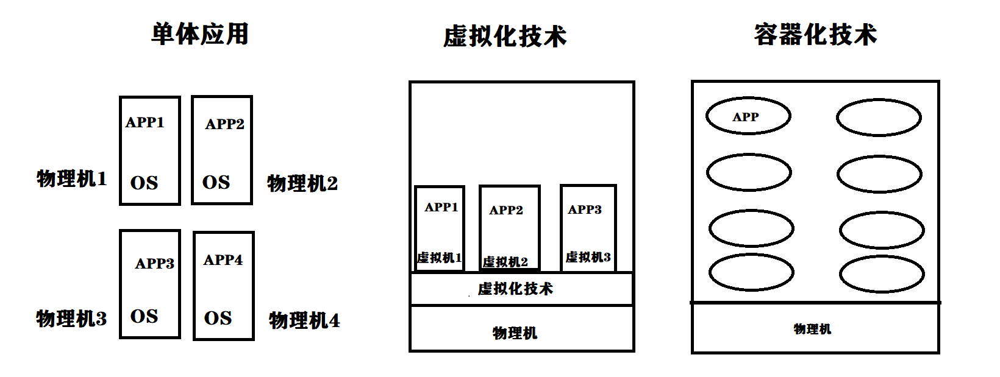
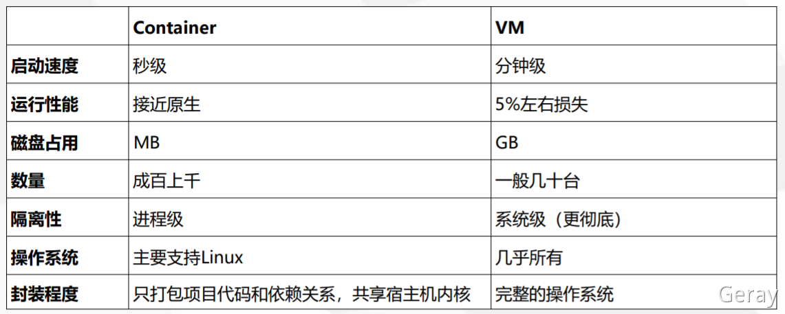
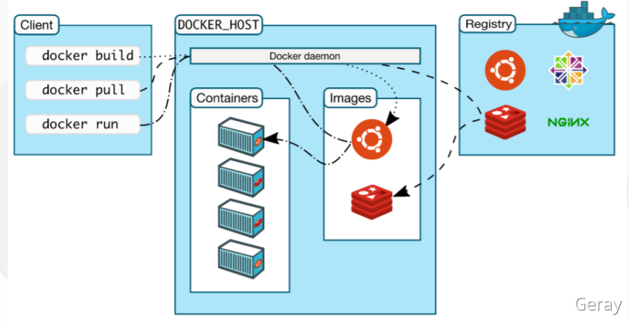
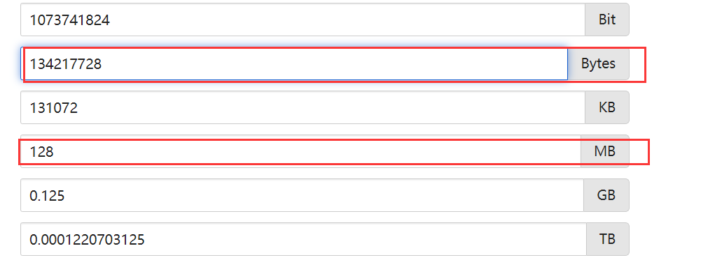
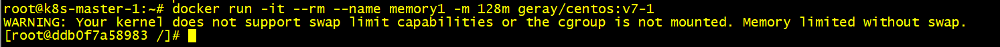

# Docker基础

## 1、Docker概述

Docker 是一个开源的应用容器引擎，基于 [Go 语言](https://www.runoob.com/go/go-tutorial.html) 并遵从 Apache2.0 协议开源。

Docker 可以让开发者打包他们的应用以及依赖包到一个轻量级、可移植的容器中，然后发布到任何流行的 Linux 机器上，也可以实现虚拟化。

容器是完全使用沙箱机制，更重要的是容器性能开销极低。

Docker 从 17.03 版本之后分为 CE（Community Edition: 社区版） 和 EE（Enterprise Edition: 企业版）

- 开源容器引擎
- 操作系统级别的虚拟化技术，进程级别的隔离
- 依赖于linux内核特性：namespace（资源隔离）和Cgroup（资源限制）
- 一个简单的应用打包工具

## 2、容器 VS 虚拟机





## 3、Docker组成

- docker client
- docker daemon
- docker image
- docker container
- docker registry




## 4、Docker安装部署

官方地址：https://docs.docker.com/engine/install/ubuntu/

### 1、环境规划

**服务器配置：**

- 建议最小配置：2核CPU、2G内存、20G硬盘
- 最好可以连接外网，方便拉取镜像，不能，提前下载镜像导入节点

**软件环境：**

| 软件   | 版本                             |
| ------ | -------------------------------- |
| Ubuntu | ubuntu-20.04.3-live-server-amd64 |
| Docker | 目前最新：20.10.12               |

**服务器规划：**

| 主机名       | IP           |
| ------------ | ------------ |
| k8s-master-1 | 192.168.6.31 |

### 2、操作系统初始化

#### 1. 配置静态IP

在Ubuntu 20.04上，系统使用“predictable network interface names(可预测的网络接口名称)”标识网络接口。

1. 识别要配置的以太网接口名称

   ```
   ip link
   ```

2. 配置分配静态IP

> Netplan配置文件存储在/etc/netplan目录中。 您可能会在此目录中找到一个或多个YAML文件。 文件的名称可能因安装程序而异。 通常，文件名为01-netcfg.yaml，50-cloud-init.yaml或NN_interfaceName.yaml

```shell
vim /etc/netplan/00-installer-config.yaml
```

- :set paste（ubuntu下的vim编辑器粘贴格式可能存在混乱）

```
# This is the network config written by 'subiquity'
network:
  ethernets:
    ens32:
      dhcp4: false
      addresses:
        - 192.168.6.31/24
      gateway4: 192.168.6.2
      nameservers:
        addresses: [8.8.8.8, 114.114.114.114]
  version: 2
```

> 要将静态IP地址分配给ens32接口，请按照以下步骤编辑文件：
>
> - 将DHCP设置为dhcp4: no。
> - 指定静态IP地址。 在addresses:下，您可以添加一个或多个将分配给网络接口的IPv4或IPv6 IP地址。
>
> - 指定网关。
> - 在nameservers下，设置以下IP地址： 域名服务器。
> - gateway4地址根据自己的自行修改，我这里之前设置的是2（一般是1）

3. 保存并应用配置

```
sudo netplan apply
```

4. 验证更改

```
ip addr show dev ens32
```

#### 2. 初始化操作系统

```shell
sudo apt-get update
# 禁用swap分区（修改/etc/fstab，注释掉swap那行，持久化生效）
swapoff -a  # 临时
sed -ri 's/.*swap.*/#&/' /etc/fstab    # 永久

# 主机名规划
hostnamectl set-hostname k8s-master-1

# 同步时间
apt-get install ntpdate -y
ntpdate time.windows.com

# 确保每个机器不会自动suspend（待机/休眠）
sudo systemctl mask sleep.target suspend.target hibernate.target hybrid-sleep.target
```

### 3、安装Docker

官方地址：https://docs.docker.com/engine/install/ubuntu/

#### 1. 卸载旧版本

```
sudo apt-get remove docker docker-engine docker.io containerd runc
```

#### 2. 设置存储库

```
sudo apt-get -y install \
  apt-transport-https \
  ca-certificates \
  curl \
  gnupg \
  lsb-release
```

#### 3. 添加Docker官方的GPG密钥

```
curl -fsSL https://download.docker.com/linux/ubuntu/gpg | sudo gpg --dearmor -o /usr/share/keyrings/docker-archive-keyring.gpg
```

#### 4. 使用以下命令设置稳定存储库

```
echo \
  "deb [arch=$(dpkg --print-architecture) signed-by=/usr/share/keyrings/docker-archive-keyring.gpg] https://download.docker.com/linux/ubuntu \
  $(lsb_release -cs) stable" | sudo tee /etc/apt/sources.list.d/docker.list > /dev/null
```

#### 5. 安装引擎

```
sudo apt-get update
sudo apt-get install -y docker-ce docker-ce-cli containerd.io
```

<!--如果要安装特定版本如下：-->

```
apt-cache madison docker-ce # 列出版本
sudo apt-get install docker-ce=<VERSION_STRING> docker-ce-cli=<VERSION_STRING> containerd.io
```

#### 6. 验证

```shell
docker info
```

#### 7、配置docker镜像加速

> 国内从 DockerHub 拉取镜像有时会遇到困难，Docker 官方和国内很多云服务商都提供了国内加速器服务
>
> - 科大镜像：**https://docker.mirrors.ustc.edu.cn/**
> - 网易：**https://hub-mirror.c.163.com/**
> - 阿里云：**https://<你的ID>.mirror.aliyuncs.com**
> - 七牛云加速器：**https://reg-mirror.qiniu.com**
>
> 阿里云镜像获取地址：https://cr.console.aliyun.com/cn-hangzhou/instances/mirrors

```shell
sudo mkdir -p /etc/docker
sudo tee /etc/docker/daemon.json <<-'EOF'
{
  "registry-mirrors": ["https://3fc19s4g.mirror.aliyuncs.com"]
}
EOF
sudo systemctl daemon-reload
sudo systemctl restart docker
```


## 5、Docker镜像

镜像不是一个单一的文件，而是有多层构成。我们可以通过`docker history <imageID/name>`  查看镜像中各层内容及大小，每层 对应着Dockerfile中的一条指令。Docker镜像默认存储在`/var/lib/docker/<storage-driver>`中。
docker官方镜像仓库 ：[https://hub.docker.com/explore](https://hub.docker.com/explore)


- 一个分层存储的文件 
- 一个软件的环境
- 一种标准化的交付 
- 一个不包含Linux内核而又精简的Linux操作系统

### 1、Docker镜像和容器的关系

**一对多，一个镜像可以创建多个容器**

容器其实是在镜像的最上面加了一层读写层，在运行容器里文件改动时， 会先从镜像里将要写的文件复制到容器自己的文件系统中（读写层)。 如果容器删除了，最上面的读写层也就删除了，改动也就丢失了。所以无论多 少个容器共享一个镜像，所做的写操作都是从镜像的文件系统中复制过来操作 的，并不会修改镜像的源文件，这种方式提高磁盘利用率。 

若想持久化这些改动，可以通过docker commit 将容器保存成一个新镜像。

### 2、Docker常用镜像管理命令

| **指令** | **描述**                                         |
| -------- | ------------------------------------------------ |
| ls       | 列出镜像                                         |
| build    | 构建镜像                                         |
| history  | 查看镜像历史                                     |
| inspect  | 显示一个或多个镜像详细信息                       |
| pull     | 拉取镜像                                         |
| push     | 推送镜像                                         |
| search   | 搜索镜像                                         |
| rmi      | 移除一个或多个镜像                               |
| prune    | 移除未使用的镜像（没有被标记或被任何容器引用的） |
| tag      | 创建一个引用源镜像标记目标镜像                   |
| export   | 导出容器文件系统到tar归档文件                    |
| import   | 导入容器文件系统tar归档文件创建镜像              |
| save     | 保存一个或多个镜像到一个tar归档文件              |
| load     | 加载镜像来自tar归档或标准输入                    |

### 3、操作实例

1. 拉取镜像`busybox:1.28.4`和`nginx`

   ```
   docker pull busybox:1.28.4
   docker pull nginx
   ```

2. 导出`nginx`镜像到`/opt/images`

   ```
   docker save nginx:latest | gzip > /opt/images/nginx-latest.tar.gz
   ```

3. 删除镜像`nginx` 

   ```
   docker rmi nginx:latest
   ```

4. 导出`nginx` 镜像，文件名为`nginx-latest.tar.gz`，位于`/opt/images`

   ```
   docker load -i nginx-latest.tar.gz
   ```

## 6、Docker容器

### 1、docker常见的容器管理命令

| **指令**           | **描述**                   |
| ------------------ | -------------------------- |
| ls                 | 列出容器                   |
| inspect            | 显示一个或多个容器详细信息 |
| exec               | 在运行的容器中执行命令     |
| commit             | 创建一个新镜像来自容器     |
| cp                 | 拷贝文件或文件夹           |
| logs               | 获取一个容器日志           |
| port               | 列出或指定容器映射端口     |
| top                | 显示一个容器运行的进程     |
| stats              | 显示容器资源使用统计       |
| stop/start/restart | 停止/启动一个或多个容器    |
| rm                 | 删除一个或多个容器         |

### 2、创建容器是常用的选项

| **选项**                          | **描述**                                 |
| --------------------------------- | ---------------------------------------- |
| -i, --interactive                 | 交互式                                   |
| -t, --tty                         | 分配一个伪终端                           |
| -d, --detach                      | 后台运行                                 |
| -e, --env                         | 设置环境变量                             |
| -p, --publish list                | 映射容器端口到主机                       |
| -P, --publish-all                 | 映射容器所有EXPOSE的端口到宿主机随机端口 |
| --name string                     | 指定容器名称                             |
| -h, --hostname                    | 设置容器主机名                           |
| --ip string                       | 指定容器ip，只能用于自定义网络           |
| --network                         | 连接容器到一个网络                       |
| -v, --volume list                 | 绑定挂载卷                               |
| --restart string  可选值：[always | on-failure]                              |

### 3、资源限制常用选项

| **选项**                    | **描述**                                        |
| --------------------------- | ----------------------------------------------- |
| -m, --memory                | 容器使用的最大内存量                            |
| --memory-swap               | 允许交换到磁盘的内存量                          |
| --memory-swappiness=<0-100> | 容器使用SWAP分区交换的百分比（0-100，默认为-1） |
| --oom-kill-disable          | 禁用OOM Killer                                  |
| --cpus                      | 可以使用的CPU数量                               |
| --cpuset-cpus               | 限制容器使用特定的CPU核心，如(0-3, 0,1)         |
| --cpu-shares                | CPU共享（相对权重）                             |

- cpuset-cpus：多个容器竞争同一CPU的时间片时，才会存在竞争现象

### 4、Docker资源限制

Docker通过linux的Cgroup 来控制容器使用的资源额度，其中有CPU、内存、磁盘等，基本覆盖了常见的资源配额和使用量控制。

防止某个或一些容器占用大量（例如某些服务被黑），影响其他容器的正常运行，资源限制显得尤为重要。

#### 1. Cgroup介绍

cgroups(Control Groups) 是 linux 内核提供的一种机制（Linux 2.6.24内核开始将Cgroup加入主线）， 这种机制可以根据需求把一系列系统任务及其子任务整合(或分隔)到按资源划分等级的不同组内，从而 为系统资源管理提供一个统一的框架。简单说，cgroups 主要用于限制和隔离一组进程对系统资源的使 用，也就是做资源QoS。可控制的资源主要包括CPU、内存、block I/O、网络带宽等等。本质上来说， cgroups 是内核附加在程序上的一系列钩子(hook)，通过程序运行时对资源的调度触发相应的钩子以达 到资源追踪和限制的目的。

#### 2. stress介绍

stress是一款[压力测试](https://so.csdn.net/so/search?q=压力测试)工具，可以用它来对系统CPU，内存，以及磁盘IO生成负载。

```
apt-get install stress

yum -y install epel-release
yum -y install stress
```

参数解释：

```
-? 显示帮助信息
-v 显示版本号
-q 不显示运行信息
-n，--dry-run 显示已经完成的指令执行情况
-t --timeout N 指定运行N秒后停止
   --backoff N 等待N微妙后开始运行
-c --cpu 产生n个进程 每个进程都反复不停的计算随机数的平方根
-i --io  产生n个进程 每个进程反复调用sync()，sync()用于将内存上的内容写到硬盘上
-m --vm n 产生n个进程,每个进程不断调用内存分配malloc()和内存释放free()函数
   --vm-bytes B 指定malloc时内存的字节数 (默认256MB)
   --vm-hang N 指示每个消耗内存的进程在分配到内存后转入休眠状态，与正常的无限分配和释放内存的处理相反，这有利于模拟只有少量内存的机器
-d --hadd n 产生n个执行write和unlink函数的进程
   --hadd-bytes B 指定写的字节数，默认是1GB
   --hadd-noclean 不要将写入随机ASCII数据的文件Unlink
    
时间单位可以为秒s，分m，小时h，天d，年y，文件大小单位可以为K，M，G
```

1. 对CPU压测

   ```
   # 运行两个进程把CPU占满，30s后结束
   stress -c 2 -v -t 30m 
   ```

2. 对内存压测

   ```
   stress -m 3 --vm-bytes 300M
   ```

3. 对磁盘压测

   ```
   stress -i 2 -d 4
   ```

### 5、操作实例

1. 使用`nginx`镜像创建一个名为`web`的容器，并以后台方式运行以及对外暴露服务（8080）

   ```
   docker run -d -p 8080:80 --rm --name web nginx
   ```

2. 使用`busybox:1.28.4`镜像创建名为`busybox`的容器，以交互式运行

   ```
   docker run -it --rm --name busybox busybox:1.28.4
   
   # 指定主机名
   docker run -it -h mytest --rm --name busybox busybox:1.28.4
   ```

3. 内存限制

   ```shell
   # 允许容器最多使用100M内存和200M的Swap，并禁用 OOM Killer：
   docker run -it --rm --name test --memory="100m" --memory-swap="200m" --oom-kill-disable geray/centos:v7-1 bash
   
   # 检查
   docker inspect test | grep -i memory
   
   # 查看内存大小（默认单位：Bytes）
   cat /sys/fs/cgroup/memory/memory.limit_in_bytes
   ```

4. CPU限制

   ```shell
   # 允许容器最多使用一个半的CPU：
   docker run -d --rm --name nginx01 --cpus="1.5" nginx
   # 允许容器最多使用50%的CPU：
   docker run -d --rm --name nginx02 --cpus=".5" nginx
   
   # 绑定容器到cpu1的核心上，并给定500的权重占比
   docker run -itd --rm --name cpu --cpuset-cpus 1 --cpu-shares 500  geray/centos:v7-1 /bin/bash
   
   # 检查CPU配置
   docker inspect cpu | grep -i cpu
   ```

5. 压测CPU：创建容器`cpu0`和`cpu1` ，同时绑定在cpu0上，并压测观察（尽管没有占100%权重，一样可以使用100%）

   ```
   docker run -itd --rm --name cpu0 --cpuset-cpus 0 --cpu-shares 500  geray/centos:v7-1 bash
   docker run -itd --rm --name cpu1 --cpuset-cpus 0 --cpu-shares 1000  geray/centos:v7-1 bash
   
   # 进入容器安装stress
   docker exec -it cpu0 bash
   yum -y install epel-release
   yum -y install stress
   
   # 压测：运行两个进程把CPU占满，30s后结束
   stress -c 2 -v -t 30m 
   ```

6. 内存：

   ```
   docker run -it --rm --name memory1 -m 128m geray/centos:v7-1
   
   # 查看内存大小（默认单位：Bytes）
   cat /sys/fs/cgroup/memory/memory.limit_in_bytes 
   
   ```

   

   如果存在警告：未开启swap分区

   

   [ubuntu](https://so.csdn.net/so/search?q=ubuntu)或其他基于Debian的系统上才会出现的问题，原因是系统默认未开启swap限制；

   > 修改系统的`/etc/default/grub`文件，修改一下参数（默认为空）
   >
   > GRUB_CMDLINE_LINUX="cgroup_enable=memory swapaccount=1"
   >
   > 1. `sudo update-grub`命令更新系统
   > 2. 重启系统

7. 创建容器`limit0` ，只能使用1个CPU核心和128m内存

   ```
   docker run -it --rm --name limit0 --cpuset-cpus 1 -m 128m  geray/centos:v7-1 bash
   ```

   

8. 使用`mysql:8` 镜像练习

```
docker pull mysql:8

docker run -d --rm --name mysql -p 3306:3306 -e MYSQL_ROOT_PASSWORD=12345 mysql:8

docker run -it mysql mysql -h 192.168.6.31 -uroot -p
```


## 7、Docker挂载


## 8、Docker网络

## 9、Dockerfile

## 10、镜像仓库Harbor

